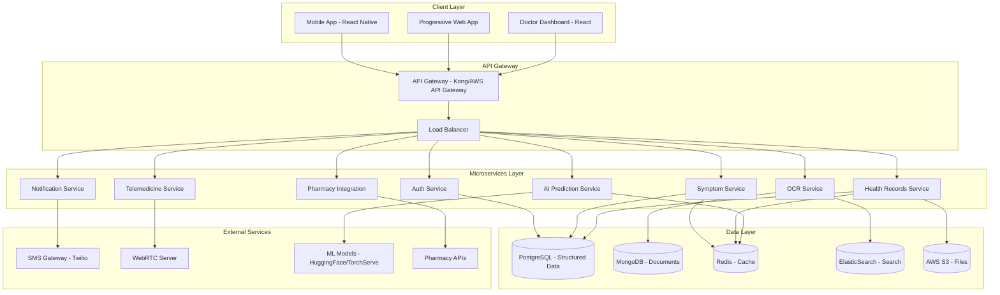
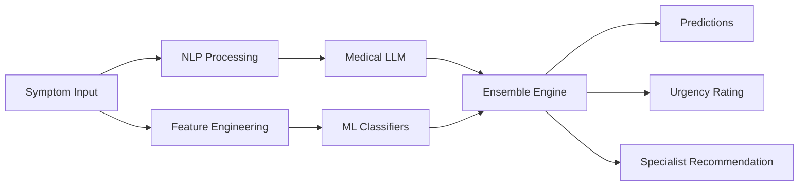

# Design Document

## Overview

The AI-Enabled Early Disease Detection Platform is designed as a microservices-based, cloud-native healthcare solution that combines artificial intelligence, optical character recognition, and telemedicine capabilities. The platform follows a mobile-first approach with offline-capable Progressive Web App (PWA) support, ensuring accessibility across diverse user groups and network conditions.

The system architecture emphasizes security, scalability, and extensibility while maintaining compliance with healthcare regulations (HIPAA, GDPR, DISHA). The platform serves multiple user types through role-based interfaces and provides comprehensive health record management with global accessibility.

## Architecture

### High-Level Architecture



### Technology Stack

**Frontend:**
- React Native (Mobile Apps) - Cross-platform mobile development
- React.js + Material-UI (Web Dashboard) - Healthcare provider interface
- Progressive Web App (PWA) - Offline-capable web access

**Backend:**
- Python FastAPI - High-performance API framework
- Microservices Architecture - Independent, scalable services
- Docker + Kubernetes - Containerization and orchestration
- Kong/AWS API Gateway - API management and routing

**Databases:**
- PostgreSQL - Primary structured data (users, records, transactions)
- MongoDB - Unstructured data (OCR results, notes, documents)
- Redis - Caching and session management
- ElasticSearch - Full-text search and analytics

**AI/ML:**
- HuggingFace Transformers - NLP and medical text processing
- TorchServe/Triton - Model serving infrastructure
- XGBoost/Random Forest - Disease classification models
- Apache Airflow - ML pipeline orchestration

**Infrastructure:**
- AWS/Azure Cloud - Multi-region deployment
- AWS S3 - Encrypted file storage
- WebRTC - Video consultation infrastructure
- Twilio - SMS and communication services

## Components and Interfaces

### 1. Authentication Service

**Purpose:** Manages user authentication, authorization, and role-based access control.

**Key Features:**
- Multi-factor authentication (MFA)
- JWT token management
- Role-based permissions (Patient, Doctor, Admin, Pharmacist)
- OAuth2/OIDC integration
- Session management with Redis

**API Endpoints:**
```
POST /auth/login
POST /auth/register
POST /auth/mfa/verify
GET /auth/profile
PUT /auth/profile
POST /auth/logout
```

### 2. Symptom Intake Service

**Purpose:** Processes multilingual symptom input and manages pictorial UI interactions.

**Key Features:**
- Multilingual text processing (Hindi, Punjabi, English)
- Pictorial symptom selection interface
- Input validation and sanitization
- Offline data caching (6 months)
- Symptom standardization and mapping

**API Endpoints:**
```
POST /symptoms/submit
GET /symptoms/pictorial-options
POST /symptoms/validate
GET /symptoms/history/{patient_id}
```

### 3. OCR Processing Service

**Purpose:** Extracts text from medical documents and provides contextual information.

**Key Features:**
- Medical document OCR with 90% accuracy
- Document type classification (prescription, lab report, imaging, discharge)
- Medication identification and context provision
- Lab value extraction with reference ranges
- Document quality assessment and enhancement

**Technology Integration:**
- Tesseract OCR engine with medical training data
- OpenCV for image preprocessing
- Custom medical vocabulary models
- Drug database integration for medication context

**API Endpoints:**
```
POST /ocr/process-document
GET /ocr/document-types
POST /ocr/extract-prescription
POST /ocr/extract-lab-report
GET /ocr/medication-context/{medication_name}
```

### 4. AI Prediction Service

**Purpose:** Provides disease predictions, urgency assessment, and specialist recommendations.

**Key Features:**
- Ensemble AI model combining multiple approaches
- Disease probability ranking
- Urgency level classification (emergency, urgent, routine)
- Specialist recommendation engine
- Historical data integration
- Model performance monitoring

**Model Architecture:**


**API Endpoints:**
```
POST /ai/predict-disease
POST /ai/assess-urgency
GET /ai/recommend-specialist
POST /ai/feedback
GET /ai/model-metrics
```

### 5. Health Records Service

**Purpose:** Manages secure, globally accessible patient health records.

**Key Features:**
- AES-256 encryption at rest and in transit
- Global accessibility with 3-second response time
- Offline caching (6 months of data)
- Patient-controlled sharing with granular consent
- Audit logging for all access and modifications
- Multi-region data replication

**Data Models:**
```python
class HealthRecord:
    patient_id: UUID
    record_type: str  # consultation, prescription, lab_result, imaging
    timestamp: datetime
    data: dict
    provider_id: UUID
    encrypted_content: bytes
    access_permissions: list
    audit_trail: list
```

**API Endpoints:**
```
GET /health-records/{patient_id}
POST /health-records/create
PUT /health-records/{record_id}
POST /health-records/share
GET /health-records/audit/{record_id}
```

### 6. Telemedicine Service

**Purpose:** Facilitates video consultations between patients and healthcare providers.

**Key Features:**
- WebRTC-based video calls optimized for low bandwidth
- Specialist routing based on availability and expertise
- Consultation scheduling and management
- Session recording and note-taking
- Integration with health records
- Quality monitoring (minimum 240p video)

**API Endpoints:**
```
POST /telemedicine/schedule-consultation
GET /telemedicine/available-specialists
POST /telemedicine/start-session
PUT /telemedicine/end-session
GET /telemedicine/session-history
```

### 7. Pharmacy Integration Service

**Purpose:** Connects with pharmacy networks for medication availability and reservation.

**Key Features:**
- Real-time pharmacy inventory queries
- Location-based pharmacy search
- Medication reservation system
- Price comparison across pharmacies
- Prescription fulfillment tracking
- Integration with multiple pharmacy chains

**API Endpoints:**
```
GET /pharmacy/search-nearby
POST /pharmacy/check-availability
POST /pharmacy/reserve-medication
GET /pharmacy/reservation-status
PUT /pharmacy/update-fulfillment
```

## Data Models

### Core Entities

**User Model:**
```python
class User:
    id: UUID
    email: str
    phone: str
    role: UserRole  # PATIENT, DOCTOR, PHARMACIST, ADMIN
    profile: UserProfile
    preferences: UserPreferences
    created_at: datetime
    last_login: datetime
    mfa_enabled: bool
```

**Patient Profile:**
```python
class PatientProfile:
    user_id: UUID
    first_name: str
    last_name: str
    date_of_birth: date
    gender: str
    languages: list[str]
    emergency_contacts: list[EmergencyContact]
    medical_conditions: list[str]
    allergies: list[str]
    current_medications: list[str]
```

**Health Record:**
```python
class HealthRecord:
    id: UUID
    patient_id: UUID
    record_type: RecordType
    title: str
    content: dict
    attachments: list[str]  # S3 URLs
    provider_id: UUID
    created_at: datetime
    tags: list[str]
    sharing_permissions: list[SharingPermission]
```

**OCR Document:**
```python
class OCRDocument:
    id: UUID
    patient_id: UUID
    document_type: DocumentType  # PRESCRIPTION, LAB_REPORT, IMAGING, DISCHARGE
    original_image_url: str
    extracted_text: str
    structured_data: dict
    confidence_score: float
    processing_status: ProcessingStatus
    created_at: datetime
    medications_identified: list[MedicationInfo]
```

**AI Prediction:**
```python
class AIPrediction:
    id: UUID
    patient_id: UUID
    symptoms: list[str]
    predictions: list[DiseasePrediction]
    urgency_level: UrgencyLevel
    recommended_specialists: list[str]
    confidence_score: float
    model_version: str
    created_at: datetime
```

### Database Schema Design

**PostgreSQL Tables:**
- users, patient_profiles, doctor_profiles
- health_records, consultations, prescriptions
- ai_predictions, symptoms, diseases
- pharmacies, medications, reservations
- audit_logs, user_sessions

**MongoDB Collections:**
- ocr_documents (unstructured OCR results)
- consultation_notes (free-form text)
- ai_model_outputs (complex prediction data)
- document_attachments (metadata)

## Error Handling

### Error Classification

**System Errors:**
- Database connection failures
- External service timeouts
- Authentication/authorization failures
- Rate limiting violations

**Business Logic Errors:**
- Invalid symptom combinations
- OCR processing failures
- AI model prediction errors
- Pharmacy integration failures

**User Input Errors:**
- Invalid data formats
- Missing required fields
- File upload size/type violations
- Language not supported

### Error Response Format

```json
{
  "error": {
    "code": "SYMPTOM_PROCESSING_FAILED",
    "message": "Unable to process symptom input",
    "details": "Unsupported language detected",
    "timestamp": "2024-01-15T10:30:00Z",
    "request_id": "req_123456789"
  }
}
```

### Retry and Fallback Strategies

**OCR Processing:**
- Retry with different preprocessing parameters
- Fallback to manual text entry option
- Queue for human review if confidence < 70%

**AI Predictions:**
- Fallback to rule-based system if ML models fail
- Use cached predictions for similar symptom patterns
- Graceful degradation with reduced feature set

**Telemedicine:**
- Automatic quality adjustment for poor connections
- Fallback to audio-only calls
- Rescheduling options for technical failures

## Testing Strategy

### Unit Testing
- **Coverage Target:** 85% code coverage
- **Framework:** pytest for Python, Jest for JavaScript
- **Focus Areas:** Business logic, data validation, utility functions
- **Mock Strategy:** External services, database connections, AI models

### Integration Testing
- **API Testing:** All service endpoints with various input scenarios
- **Database Testing:** Data persistence, migrations, performance
- **External Service Testing:** Pharmacy APIs, SMS gateways, WebRTC

### End-to-End Testing
- **User Journeys:** Complete patient workflows from symptom input to consultation
- **Cross-Platform:** Mobile app, PWA, and web dashboard compatibility
- **Performance Testing:** Load testing for concurrent users, response times

### Security Testing
- **Authentication:** MFA flows, token validation, session management
- **Authorization:** Role-based access control, data sharing permissions
- **Data Protection:** Encryption validation, audit log integrity
- **Vulnerability Scanning:** OWASP compliance, dependency scanning

### AI/ML Testing
- **Model Performance:** Accuracy, precision, recall metrics
- **Bias Detection:** Fairness across demographic groups
- **Drift Monitoring:** Model performance degradation over time
- **A/B Testing:** Comparing different model versions

### Compliance Testing
- **HIPAA Compliance:** Data handling, access controls, audit trails
- **GDPR Compliance:** Data portability, right to deletion, consent management
- **DISHA Compliance:** Indian healthcare data protection requirements

This design provides a comprehensive foundation for building the AI-enabled health platform with strong emphasis on security, scalability, and user experience across diverse healthcare scenarios.